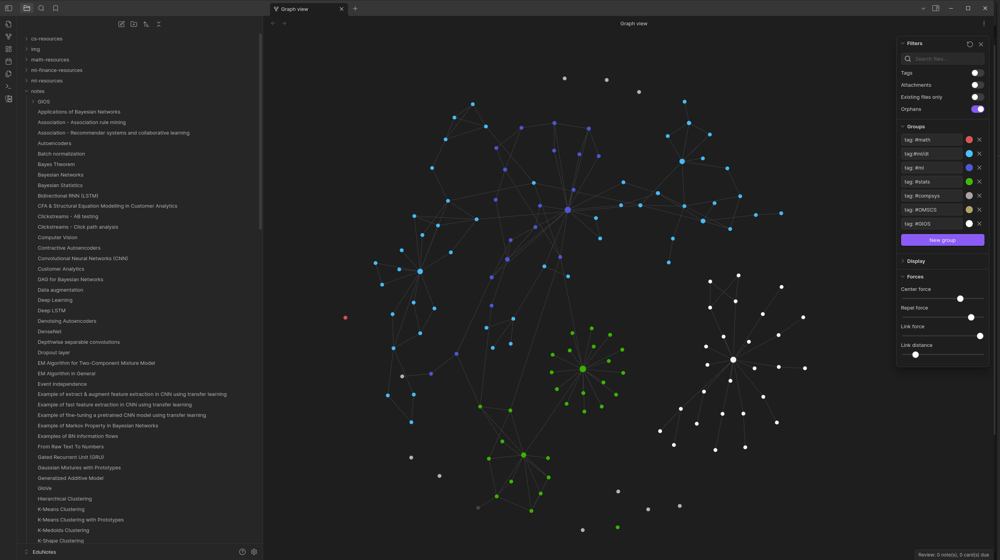

# brain-cache

This repository serves as a storage space for notes I create during my learning journey. While I don't document every exercise or implementation, I use this repository to organize and store notes from lectures, books, or papers that I find useful. This doesn’t mean I document everything, though; only material that benefits from creating structured notes typically ends up here.

The material found here can primarily be attributed to my studies at Aarhus University or Georgia Institute of Technology. Occasionally, notes from additional learning resources may also appear here.

Some of these notes may include content copied from other sources, and I’ve made an effort to include citations within the respective files. If you discover any content from your work that hasn’t been cited or cited well, please feel free to open a pull request to address it.

The notes here are primarily for personal reference and may occasionally be compiled into PDF documents for easier reading and review.

## Usage

[Obsidian.md](https://github.com/obsidianmd) is used to organize and manage these notes efficiently. It performs well in handling large collections of interconnected notes, offering powerful features such as linking notes to each other, setting custom properties, and visualizing relationships through its graph view. This makes it particularly suited for managing complex or extensive learning material.

Additionally, Obsidian's extensibility through a wide range of community plugins enhances its functionality far beyond basic note-taking. Currently, the version I use is **v1.7.7**.  

## Resources ignored

Due to copyright considerations, many resources are not pushed to this repository but are instead stored on Google Drive. These include collections of books, papers, and lecture materials.